[](https://travis-ci.org/IBM/Hybrid-Cloud-Applications-and-Services)

# 프라이빗 클라우드 애플리케이션 및 서비스를 퍼블릭 클라우드로 확장하기 또는 그 반대로 적용하기

*다른 언어로 보기: [English](README.md).*

하이브리드 클라우드 모델은 프라이빗 및 퍼블릭 클라우드의 요소를 혼합하여 온프레미스 시스템과 클라우드에서 앱과 서비스를 실행할 수 있는 선택권과 유연성을 제공합니다. 하이브리드 모델을 가장 단순하게 나타낸다면, 필요할 때 퍼블릭 클라우드와 연동할 수 있는 프라이빗 클라우드를 주로 말합니다. 이 개발과정에서는 온프레미스 애플리케이션 및 서비스를 퍼블릭 클라우드에 노출하는 방법과 그 반대의 경우를 배울 수 있습니다. 

이 개발과정에는 JAX-RS 및 Swagger 주석을 사용하는 온프레미스 Java 애플리케이션과 CouchDB를 사용하는 데이터베이스가 있습니다. 둘 다 방화벽 뒤의 프라이빗 클라우드에서 실행됩니다. Secure Gateway 및 API Connect와 같은 퍼블릭 클라우드 서비스를 활용하여 터널을 만들고 프라이빗 클라우드 애플리케이션과 API를 회사 방화벽 외부에 노출시키는 방법이 소개됩니다.

퍼블릭 클라우드로 애플리케이션을 이동시킨 다음, 퍼블릭 클라우드에서 실행되는 애플리케이션이 데이터베이스와 같은 온프레미스 리소스에 어떻게 접근할 수 있는지에 대해서도 안내합니다.

## 시나리오
- [시나리오 1: 퍼블릭 클라우드를 통해 프라이빗 클라우드 애플리케이션을 외부에서 접근할 수 있도록 설정](#시나리오-1-퍼블릭-클라우드를-통해-프라이빗-클라우드-애플리케이션을-외부에서-접근할-수-있도록-설정)
- [시나리오 2: 퍼블릭 클라우드의 애플리케이션을 프라이빗 클라우드의 리소스에 연결할 수 있도록 설정](#시나리오-2-퍼블릭-클라우드의-애플리케이션을-프라이빗-클라우드의-리소스에-연결할-수-있도록-설정)

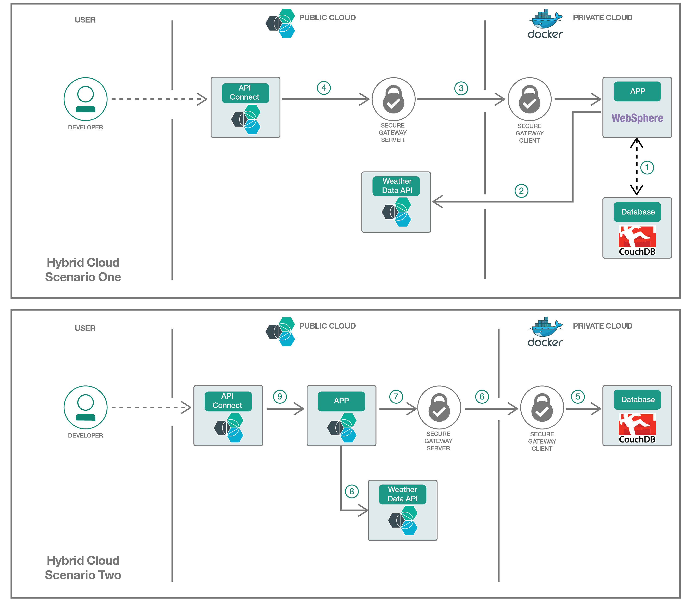

## 구성 요소
시나리오는 다음을 사용하여 수행됩니다:
- [Cloud Foundry](https://www.cloudfoundry.org/)
- [CouchDB](http://couchdb.apache.org)
- [WebSphere Liberty](https://developer.ibm.com/wasdev/websphere-liberty/)
- [API Connect](http://www-03.ibm.com/software/products/en/api-connect)
- [Secure Gateway](https://console.ng.bluemix.net/docs/services/SecureGateway/sg_overview.html)
- [Insights for Weather](https://console.ng.bluemix.net/docs/services/Weather/weather_overview.html#about_weather)

## 사전 준비 사항

예제 애플리케이션을 빌드 하려면 [Maven](https://maven.apache.org/install.html)이, 애플리케이션과 데이터베이스를 실행하려면 [Docker](https://www.docker.com/community-edition#/download)가 필요하므로, [단계](#steps)를 진행하기 전에 [Maven](https://maven.apache.org/install.html)과 [Docker](https://www.docker.com/community-edition#/download)를 설치 하십시오. 임시적인 환경 관리를 위해 [Vagrant](https://www.vagrantup.com/)를 사용하기를 선호하는 경우, 프로젝트 홈 디렉토리에 있는 빌드 파일을 이용하여 JDK, Maven 및 Docker가 설치된 Ubuntu 가상 머신을 생성 하십시오.

## 단계

### 온프레미스 환경을 퍼블릭 클라우드에 연결
1. [온프레미스 환경을 퍼블릭 클라우드에 연결하는 터널 만들기](#1-온프레미스-환경을-퍼블릭-클라우드에-연결하는-터널-만들기)

### 시나리오-1: 퍼블릭 클라우드를 통해 프라이빗 클라우드 애플리케이션을 외부에서 접근 가능하도록 설정하기

2. [온프레미스로 실행 및 온프레미스 데이터베이스를 사용하기 위한 예제 애플리케이션 빌드하기](#2-온프레미스로-실행-및-온프레미스-데이터베이스를-사용하기-위한-예제-애플리케이션-빌드하기)
3. [WebSphere Liberty, CouchDB 및 Docker를 사용하여 온프레미스에서 애플리케이션 및 데이터베이스 실행하기](#3-websphere-liberty-couchdb-및-docker를-사용하여-온프레미스에서-애플리케이션-및-데이터베이스-실행하기)

### 시나리오 2: 퍼블릭 클라우드의 애플리케이션을 프라이빗 클라우드의 리소스에 연결할 수 있도록 설정하기

4. [퍼블릭 클라우드에서 실행하고 온프레미스 데이터베이스를 사용하기 위한 예제 애플리케이션 빌드하기](#4-퍼블릭-클라우드에서-실행하고-온프레미스-데이터베이스를-사용하기-위한-예제-애플리케이션-빌드하기)
5. [Bluemix를 사용하여 퍼블릭 클라우드에서 애플리케이션을 실행하고 CouchDB 및 Docker를 사용하여 온프레미스에서 데이터베이스 실행하기](#5-bluemix를-사용하여-퍼블릭-클라우드에서-애플리케이션을-실행하고-couchdb-및-docker를-사용하여-온프레미스에서-데이터베이스-실행하기)

### API Connect를 사용하여 애플리케이션 API를 카탈로그화 하고 공개하기
6. [Bluemix에서 API Connect 서비스 만들기](#6-bluemix에서-api-connect-서비스-만들기)
7. [WebSphere Liberty와 API Connect의 통합: 밀어넣기와 가져오기](#7-websphere-liberty와-api-connect의-통합-밀어넣기와-가져오기)
- 7.1 [WebSphere에서 실행 중인 애플리케이션 API를 API Connect로 밀어넣기](#71-websphere에서-실행-중인-애플리케이션-api를-api-connect로-밀어넣기)
- 7.2 [API Connect에서 WebSphere에서 실행 중인 애플리케이션 API를 가져오기](#72-api-connect에서-websphere에서-실행-중인-애플리케이션-api를-가져오기)

[문제 해결](#문제-해결)

# 1. 온프레미스 환경을 퍼블릭 클라우드에 연결하는 터널 만들기

이 단계에서는 Bluemix의 Secure Gateway 서비스를 사용하여 온프레미스 환경에서 퍼블릭 클라우드 호스트로 터널을 생성합니다. 이 예제에서는 구성을 간단하게 유지하기 위해 TCP 프로토콜이 사용됩니다. Secure Gateway 제품은 보안 게이트웨이 서비스를 사용하는 애플리케이션에 더 강력한 보안 및 인증 옵션을 제공할 수있는 다른 프로토콜 옵션 (UDP, HTTP, HTTPS, TLS / SSL)을 제공합니다. 프로덕션용 애플리케이션 및 데이터가 있는 솔루션은 리스크 프로파일을 기반으로 평가되어야하며 적절한 Secure Gateway 액세스 프로토콜 및 인증 스키마를 선택해야 합니다. Secure Gateway 구성에 대한 자세한 내용은 [여기](https://console.ng.bluemix.net/docs/services/SecureGateway/sg_overview.html#sg_overview)에서 찾을 수 있으며 응용 프로그램측 및 클라이언트측 TLS 설정에 대한 예제는 [여기](https://console.ng.bluemix.net/docs/services/SecureGateway/sg_023.html#sg_023)에서 확인할 수 있습니다. 여기에서는 개념을 보여주기 위해 TCP로 진행합니다.

1. Bluemix에서 [Secure Gateway 서비스](https://console.ng.bluemix.net/catalog/services/secure-gateway?taxonomyNavigation=apis)를 생성하십시오.

2. 그런 다음, [Secure Gateway 시작하기](https://console.ng.bluemix.net/docs/services/SecureGateway/secure_gateway.html) 튜토리얼을 따라 게이트웨이를 설정하십시오.

3. Secure Gateway 클라이언트를 설정할 때, 프라이빗 클라우드에 **IBM 설치 프로그램**을 설치하고 실행하십시오.

	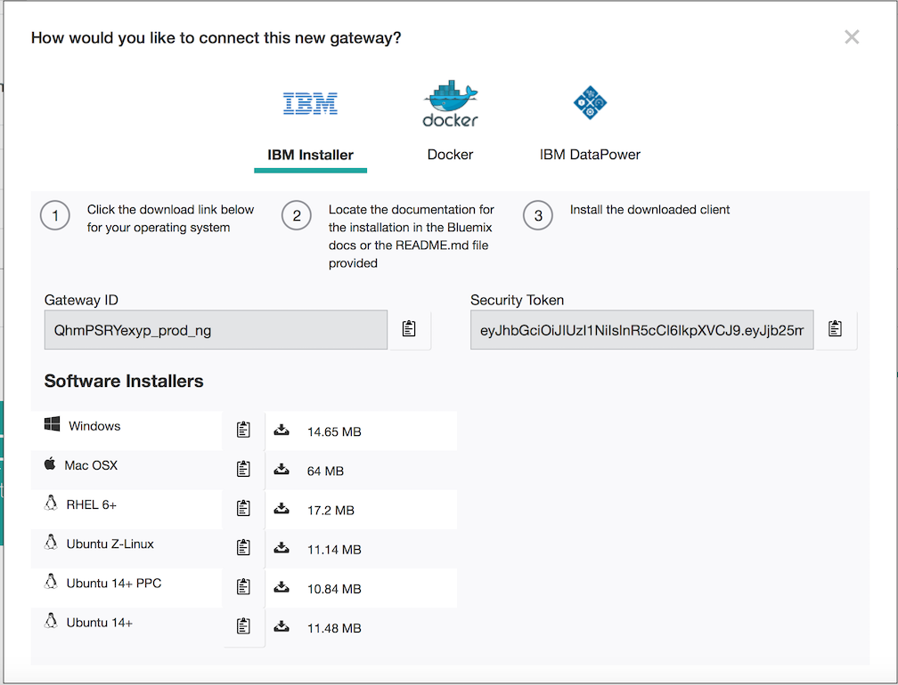

4. Gateway ID와 Security Token으로 Secure Gateway 클라이언트를 열고, 온프레미스 Endpoint에 대한 액세스 리스트 항목을 추가해야 합니다. [시나리오 1: 퍼블릭 클라우드를 통해 프라이빗 클라우드 애플리케이션을 외부에서 접근 가능하도록 설정하기](#시나리오-1-퍼블릭-클라우드를-통해-프라이빗-클라우드-애플리케이션을-외부에서-접근-가능하도록-설정하기)를 진행하고 있다면, 애플리케이션 서버에 접근 할 수 있도록 Secure Gateway 클라이언트에서 `acl allow 127.0.0.1:9443` 명령을 실행하십시오. [시나리오-2-퍼블릭-클라우드의-애플리케이션을-프라이빗-클라우드의-리소스에-연결할-수-있도록-설정하기](#시나리오-2-퍼블릭-클라우드의-애플리케이션을-프라이빗-클라우드의-리소스에-연결할-수-있도록-설정하기)를 진행하는 경우, 데이터베이스에 접근할 수 있도록 `acl allow 127.0.0.1:5984`를 실행하십시오.

5. 이제 Bluemix의 Secure Gateway 페이지로 돌아가서 대상을 만듭니다. 먼저 설정 안내에서 **사내 구축형**을 선택하고 다음을 클릭합니다.

	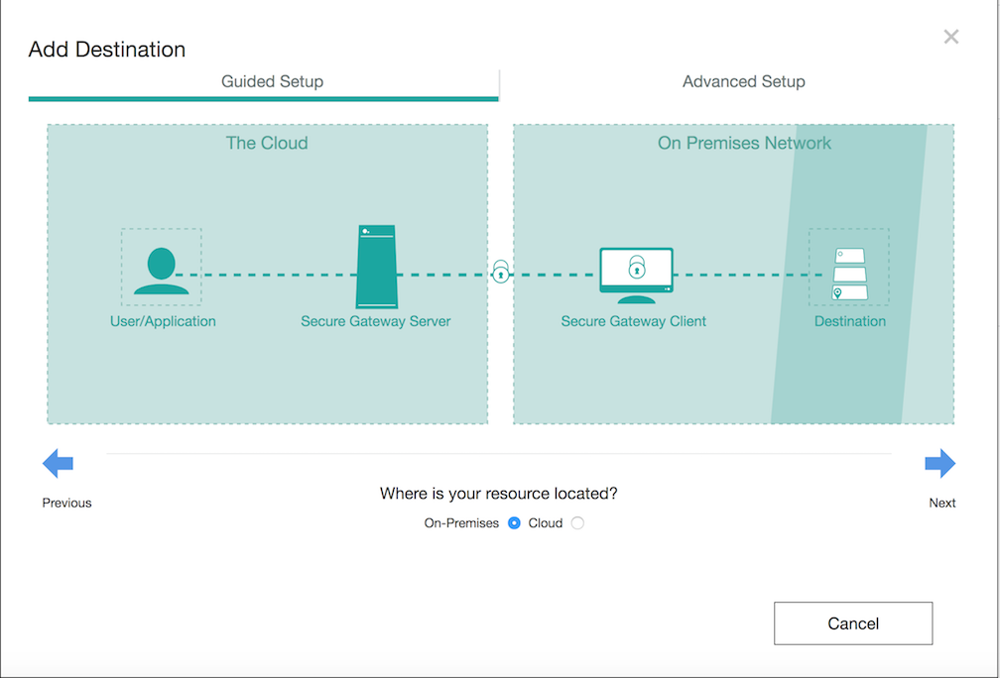

6. 다음은, 자원 호스트 이름에 **127.0.0.1**을 포트에 **9443**(시나리오 1) / **5984**(시나리오 2)를 입력 후 다음을 클릭합니다.

	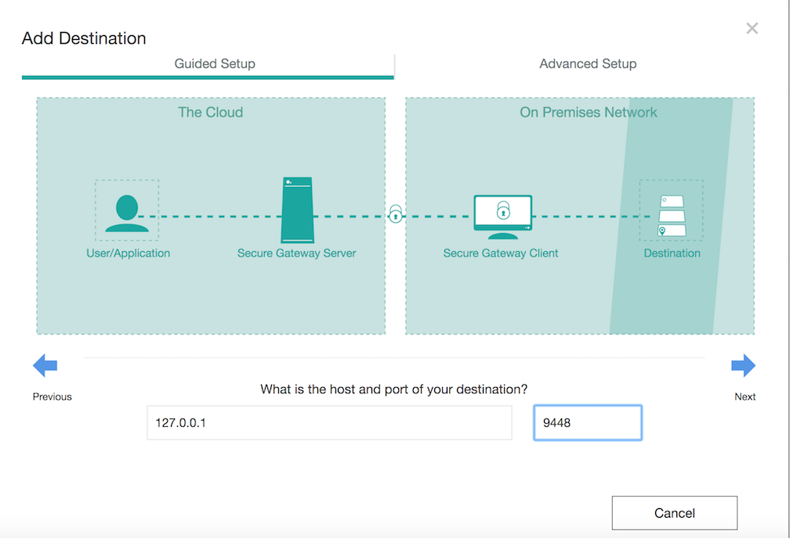

7. 그런 다음 프로토콜에 **TCP** 를 선택하고 다음을 클릭하십시오. 그 다음, 인증 유형에 **None**을 선택하고 다음을 클릭하십시오. 그 다음, IP 테이블 규칙에 어떤 것도 넣지않고 다음을 클릭하십시오. 마지막으로 대상의 이름을 지정하고 **대상 추가** 버튼을 클릭하십시오.

8. 대상의 **톱니바퀴 아이콘**을 클릭하여 클라우드 호스트의 정보를 보고 메모해 놓습니다.

	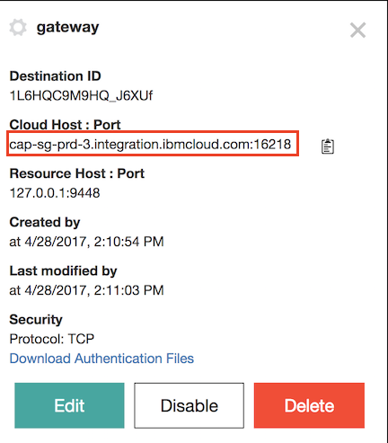

    시나리오 1인 경우 계속 진행하시고, 아닌 경우에는 [시나리오 2](#4-퍼블릭-클라우드에서-실행하고-온-프레미스-데이터베이스를-사용하기-위한-예제-애플리케이션-빌드하기)로 건너 뜁니다.

# 2. 온프레미스로 실행 및 온프레미스 데이터베이스를 사용하기 위한 예제 애플리케이션 빌드하기

예제인 Airline API 애플리케이션은 온프레미스 데이터베이스를 사용하여 데이터를 저장하는 방법을 보여주는 항공 예약 애플리케이션입니다.

우리는 또한 퍼블릭 Bluemix에서 애플리케이션을 위한 Weather API 신임 정보을 추가하고 Maven을 이용하여 .war 파일을 빌드할 것입니다. Weather API는 고객이 선택한 도착 공항의 기상 조건을 제공합니다.

1. Bluemix에서 [Weather API 서비스](https://console.ng.bluemix.net/catalog/services/weather-company-data?taxonomyNavigation=data)를 생성하십시오.

2. Weather API의 **서비스 신임 정보**로 이동하여 username과 password를 확인 하십시오. 그런 다음 `cd flight-booking/src/main/java/microservices/api/sample` 명령을 실행하여 sample 디렉토리로 이동하십시오. 이제, **WeatherAPI.java** 파일에 username과 password를 추가하십시오.

	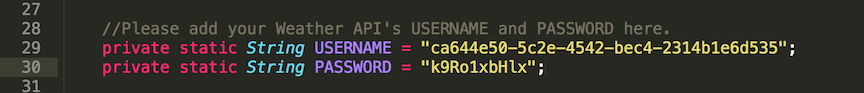

3. **flight-booking** 디렉토리로 돌아가서, `mvn package`를 실행하여 .war 파일을 빌드하십시오.


4. 이제, **deployment_artifacts** 디렉토리로 이동하여 **airlines.war** 파일을 메인 디렉토리의 **airline_app/apps** 폴더로 이동하십시오.


# 3. WebSphere Liberty, CouchDB 및 Docker를 사용하여 온-프레미스에서 애플리케이션 및 데이터베이스 실행하기

이 예제에서는 애플리케이션 서버로 WebSphere Liberty를 사용하고 데이터베이스에는 로컬 CouchDB를 사용합니다. 먼저 애플리케이션 서버 Docker 이미지를 만듭니다.

이 단계가 끝나면 localhost를 통해 애플리케이션 API를 호출할 수 있어야합니다.

1. Airline API 애플리케이션을 배포하려면, **.war** 파일을 **airline_app/apps** 폴더에 넣고 **server.xml** 파일을 구성하십시오. 이 예제에서는 Airline API 애플리케이션을 사용하고 있지만 자체 애플리케이션을 추가 할 수도 있습니다.

	기본 디렉토리에서 서버를 빌드하고 로컬 호스트에서 실행하십시오.

    ```bash
    docker build -t hybrid/airlines .
    docker-compose up
    ```
   	애플리케이션 서버 및 데이터베이스 컨테이너가 시작되고 터미널은 애플리케이션의 모든 로그를 표시합니다.

    서버와 데이터베이스를 실행한 후 다른 터미널을 열고 다음 명령을 실행하여 couchDB를 시작하십시오.

    ```bash
    bash database_init.sh
    ```

2. WebSphere Liberty API Discovery의 UI를 찾으려면 `https://localhost:9443/ibm/api/explorer`로 이동하십시오. 자체 서명된 인증서에 대한 인증서 경고를 수락하십시오. server.xml의 신임 정보를 사용하여 로그인합니다 (이 예제에서는, **username**은 `admin` 그리고 **password**은 `admin`입니다).

	API Discovery UI에서 이와 비슷한 내용을 볼 수 있습니다.

	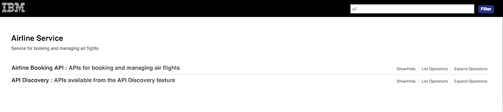

3. 다음 화면 캡처에서와 같이, **시작해 보십시오** 버튼을 클릭하면 예제 Docker에서 실행되는 Airline 애플리케이션이 시작됩니다

	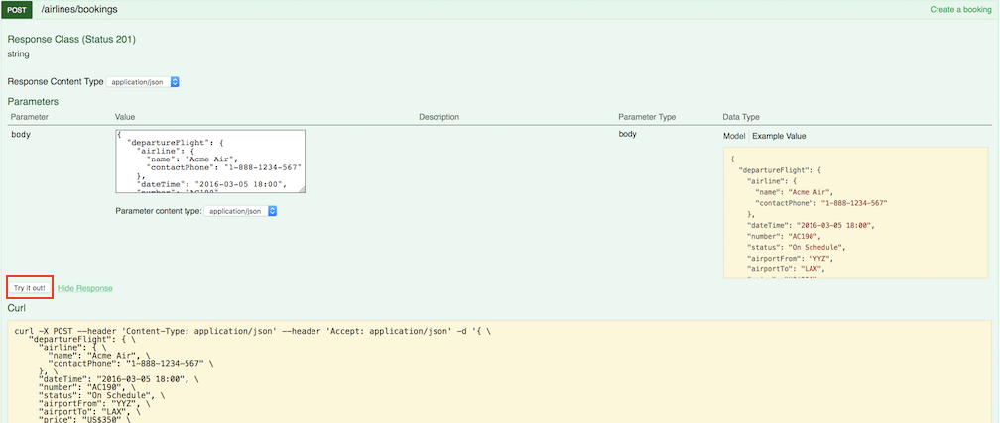

4. 이제, `https://<Cloud Host:Port>/ibm/api/explorer/`로 이동하여 퍼블릭 'Cloud Host' 게이트웨이 서버로부터 로컬 서버 인터페이스로 접근이 가능한지 확인 하십시오. 'Cloud Host'는 [1 단계](#1-온-프레미스-환경을-퍼블릭-클라우드에-연결하는-터널-만들기) 마지막에 메모해 둔 Secure Gateway 서버 정보이며, 기본 username는 **admin** 그리고 비밀번호는 **admin**인 것을 기억하십시오. 이 예제에서 우리는 TCP를 사용하고 있기 때문에, 이 URL로 접근이 가능하다는 것은 Cloud Host와 port를 알고 있다면 인터넷 상의 어느 시스템도 WebSphere Liberty 애플리케이션에 연결할 수 있음을 의미합니다. 프로덕션 환경에서는, 보안 강화를 위해 [상호 인증](https://console.ng.bluemix.net/docs/services/SecureGateway/sg_023.html#sg_007)을 사용하는 TLS/SSL을 사용합니다.

API Connect를 통해 애플리케이션 API를 노출하기 위해 [6 단계](#6-bluemix에서-api-connect-서비스-만들기)로 이동하십시오.

# 4. 퍼블릭 클라우드에서 실행하고 온프레미스 데이터베이스를 사용하기 위한 예제 애플리케이션 빌드하기

예제 API 애플리케이션은 온프레미스 데이터베이스를 사용하여 데이터를 저장하고 Bluemix의 Data Analytic 서비스를 사용하여 API 기능을 향상시키는 방법을 보여주는 항공 예약 애플리케이션입니다.

이 단계에서는, 우리의 애플리케이션에 대한 자체 Weather API 신임 정보를 추가하고 Maven을 사용하여 자체 .war 파일을 빌드합니다.

1. [Weather API 서비스](https://console.ng.bluemix.net/catalog/services/weather-company-data?taxonomyNavigation=data)를 만드십시오. Weather API는 고객의 공항 위치 및 기상 조건을 제공할 수 있습니다


2. Weather API의 **Service credentials**로 가서 username 과 password를 확인하십시오. 그리고 `cd flight-booking/src/main/java/microservices/api/sample` 명령을 실행하여 sample 디렉토리로 이동하십시오. 이제, username과 password를 **WeatherAPI.java** 파일에 추가하십시오.

    

3. 추가적으로, **DatabaseAccess.java** 파일에 있는 데이터베이스 주소를 *cloud host:port* 로 변경하십시오.

    


4. **flight-booking** 디렉토리로 돌아가, `mvn package` 명령을 실행하여 .war 파일을 빌드하십시오.


5. 그리고 **deployment_artifacts** 디렉토리로 이동하여  **airlines.war** 파일을 메인 디렉토리의 **airline_app/apps** 폴더로 이동하세요.


# 5. Bluemix를 사용하여 퍼블릭 클라우드에서 애플리케이션을 실행하고 CouchDB 및 Docker를 사용하여 온프레미스에서 데이터베이스 실행하기

1. Docker를 이용하여 온-프레미스 데이터베이스를 실행합니다. 커뮤니티의 CouchDB Docker 이미지를 사용하기 위해 다음 명령을 실행하세요.

    ```bash
    docker pull couchdb:latest
    docker run -p 5984:5984 couchdb
    ```

    그 다음, 아래 스크립트로 couchDB를 초기화합니다.

    ```bash
    bash database_init.sh
    ```

2. 이제, 메인 디렉토리로 돌아가 애플리케이션을 클라우드로 배포 하십시오. 이 예제에서는, 애플리케이션을 IBM Cloud Foundry에 배포합니다. 그러므로 [Cloud Foundry CLI](https://docs.cloudfoundry.org/cf-cli/install-go-cli.html)를 설치해야 합니다.

3. Cloud Foundry에 로그인하고 애플리케이션을 클라우드로 배포하기 위해 다음 명령을 사용하십시오.

    >참고: <app_name>을 Bluemix 지역별 고유한 이름으로 대체하십시오. 이 애플리케이션의 이름은 API 컨테이너의 이름입니다.

    ```bash
    cf login -a https://api.ng.bluemix.net
    cf push <app_name> -p airline_app
    ```

3. 애플리케이션 API Discovery UI에 접근하기 위해 https://<app_name>.mybluemix.net/ibm/api/explorer 로 이동합니다. 그 다음, server.xml의 신임 정보를 사용하여 로그인합니다 (이 예제에서는, the **username**은 `admin` 그리고 **password**는 `admin`입니다).

    API Discovery UI에서 아래와 비슷한 내용을 볼 수 있습니다.


    

4. 다음 화면 캡처에 표시된 것처럼, **시작해 보십시오** 버튼을 클릭하면, Cloud Foundry에서 실행되며 온-프레미스 데이터베이스를 사용하는 애플리케이션을 호출합니다.

    

# 6. Bluemix에서 API Connect 서비스 만들기

이 단계에서는, 애플리케이션 API를 퍼블릭으로 노출할 수 있도록 API Connect 서비스를 설정합니다.


1. API Connect을 Bluemix 서비스로 추가하려면, Bluemix [API Connect 서비스](https://console.ng.bluemix.net/catalog/services/api-connect?taxonomyNavigation=services)로 이동하십시오.


2. 그런 다음, **Essentials 플랜**을 선택하고 **작성**을 클릭합니다.

3. 아래를 클릭하여 대시보드로 이동하십시오.

	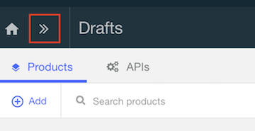

4. 기본적으로, **Sandbox**라는 빈 카탈로그가 생성됩니다. 해당 개발자 포털을 사용하려면, **Sandbox**를 클릭 후 **설정**을 클릭합니다.

5. **포털**을 클릭 후 **포털 구성** 아래, **IBM 개발자 포털**을 선택하십시오. 포털 URL은 자동으로 삽입됩니다.

6. 포털 URL을 메모해두어 나중에 필요한 대상 서버 주소 및 조직을 알 수 있습니다. URL은 다음 화면 캡처와 같이 다음 세 부분으로 나뉩니다:

	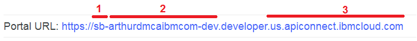

    - 1번은 카탈로그의 짧은 이름이며,이 경우 sb입니다.
    - 2번은 조직 ID입니다 (예 : arthurdmcaibmcom-dev).
    - 3번은 API Connect 인스턴스의 대상 주소입니다. (예: https://us.apiconnect.ibmcloud.com).

7. 오른쪽 상단에 있는 저장 아이콘을 클릭하십시오. 그러면 다음과 같은 메시지가 표시됩니다:

    `
    'Sandbox' 카탈로그를 위한 개발자 포털을 작성하는 데에는 몇 분이 소요될 수 있습니다. 포털이 사용 가능하게 되면 이메일이 발송됩니다.
    `

8. 이메일을 받으면, **포털 URL**로 이동하여 다음과 같은 것을 볼 수 있습니다.

	

	이곳은 엔터프라이즈 개발자가 API 카탈로그에 노출된 제품(예를 들면, API나 API 그룹)을 찾기 위한 곳입니다. 또한 개발자는 블로그나 포럼 링크를 통해 서로 상호 교류도 할 수 있습니다.
	

# 7. WebSphere Liberty와 API Connect의 통합: 밀어넣기와 가져오기
> API Connect로 WebSphere Liberty APIs를 [밀어넣을지](#71-websphere에서-실행-중인-애플리케이션-api를-api-connect로-밀어넣기) API Connect에서 WebSphere 또는 Liberty APIs를 [가져올지](#72-api-connect에서-websphere에서-실행-중인-애플리케이션-api를-가져오기)를 선택 하십시오. 참고: 현재 Bluemix에 접근하는 기업용 연합 IBMid 계정을 가진 사용자의 경우 밀어넣기 통합은 사용할 수 없습니다.

## 7.1 WebSphere에서 실행 중인 애플리케이션 API를 API Connect로 밀어넣기

이 단계에서는, API Connect에 우리 API를 밀어넣기 위해 API Discovery에서 Post 요청을 사용하는 방법에 대해 알아봅니다.

1. `https://<Cloud Host:Port/app_name>/ibm/api/explorer/`로 이동하십시오

2. apiconnect 엔드포인트의 **POST**를 클릭하십시오

	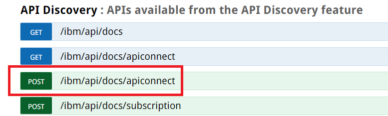

3. 다음 스크린 캡쳐에 나온 것과 같이 파라메터를 채우십시오. organization ID는 포털 URL의 두 번째 부분입니다.

	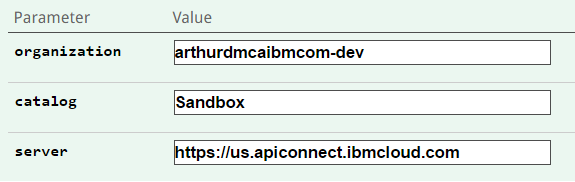

4. 이 API 제품을 단지 스테이징만 하는 것이 아니라 공개하여 게시하려는 경우, stageOnly 파라메터를 false로 둡니다. X-APIM-Authorization 파라메터는 Liberty가 API Connect에 로그인 할 때 사용하는 신임 정보를 나타냅니다. 오른쪽에 있는 설명은 허용된 형식에 대한 상세 정보를 제공합니다. 아래 예제에서는 : `apimanager/bluemixAccount@domain.com:myBluemixPassword`를 사용합니다.

	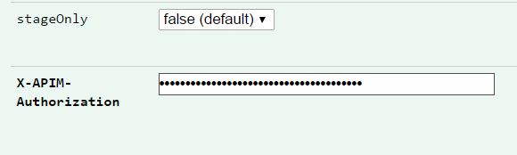


5. 시나리오 2에서는, 오른쪽에 예제 JSON 파일을 클릭하고 API를 게시할 수 있습니다.

	시나리오 1에서는, 우리 API가 프라이빗 클라우드에서 실행하고 있고 API 대상 URL이 프라이빗 클라우드를 설정하기 때문에 예제 JSON 파일을 사용하지 않았습니다. 그 대신, 아래와 같은 JSON 파일(**discovery-post.json** 파일에서도 얻을 수 있음)에서  **target-url** (38 라인)의 `<cloud host:port>` 부분을 cloud host:port (예를 들어. `"https://cap-sg-prd-3.integration.ibmcloud.com:16218$(request.path)"`)로 변경하려 합니다. 그리고, 내용을 복사하여 body에 붙여 넣으십시오.
	```JSON
	{
	  "product": "1.0.0",
	  "info": {
	    "name": "pushed-product",
	    "title": "A Product that encapsulates Liberty APIs",
	    "version": "1.0.0"
	  },
	  "visibility": {
	    "view": {
	      "enabled": true,
	      "type": "public",
	      "tags": [
	        "string"
	      ],
	      "orgs": [
	        "string"
	      ]
	    },
	    "subscribe": {
	      "enabled": true,
	      "type": "authenticated",
	      "tags": [
	        "string"
	      ],
	      "orgs": [
	        "string"
	      ]
	    }
	  },
	  "apis": {
	    "liberty": {
	      "name": "liberty-api:1.0.0",
	      "x-ibm-configuration": {
	        "assembly": {
	          "execute": [
	            {
	              "invoke": {
	                "target-url": "<cloud host:port>$(request.path)",
	                "title": "Invocation"
	              }
	            }
	          ]
	        }
	      }
	    }
	  },
	  "plans": {
	    "default": {
	      "title": "Default Plan",
	      "rate-limit": {
	        "value": "100/hour",
	        "hard-limit": false
	      },
	      "approval": false
	    }
	  },
	  "createdAt": "2017-05-01T16:13:05.912Z",
	  "createdBy": "string"
	}
	```
	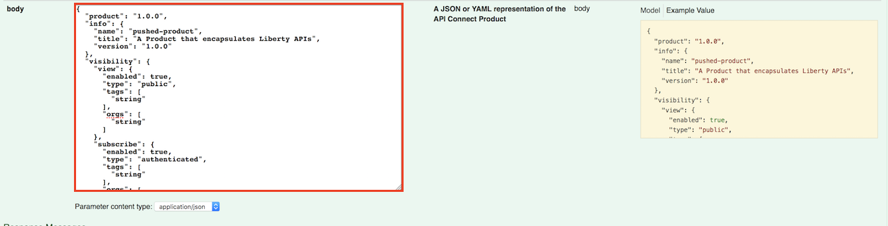

6. 이제 이 API를 게시할 준비가 되었습니다. **시작해 보십시오**를 클릭하십시오.

	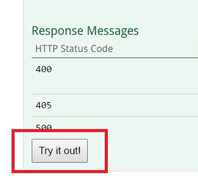

7. 잠시 후, 응답 내용, 코드 그리고 헤더가 아래 캡쳐에서와 같이 성공적(응답 코드 200)으로 반환된 것을 볼 수 있습니다:

	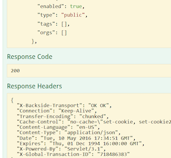

축하합니다. API가 공개되어 게시되었습니다. 이제 API를 사용하고자하는 소비자들처럼 API Connect 개발자 포털을 탐색 할 수 있습니다. **포털 URL**로 이동하여 **API 제품**을 클릭 하십시오.

API 제품을 선택하고 API Connect 개발자 포털을 통해 사용해 보십시오. 어떤 API든지 클릭하고 **오퍼레이션 호출** 버튼을 이용하여 시도해 보십시오.

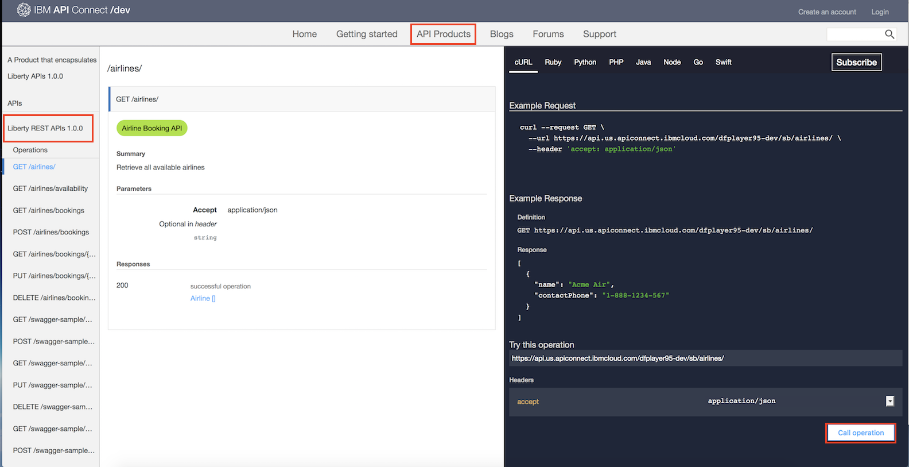

## 7.2 API Connect에서 WebSphere에서 실행 중인 애플리케이션 API를 가져오기

이 단계에서는 API Connect의 UI를 이용하여 API Connect에 새로운 API 및 제품을 만들고 관리하는 방법에 대해 알아 봅니다.


1. Bluemix의 기본  API Connect 대시보드에서, 메뉴 아이콘을 클릭하고 **드래프트**를 선택하십시오. **API**를 클릭하고, **추가**를 클릭하고, 그리고 **파일 또는 URL에서 API 가져오기**를 선택하십시오.

	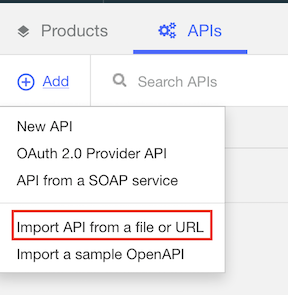

2. **파일 또는 URL에서 API 가져오기** 화면에서, **또는 URL에서 API 가져오기**를 클릭하십시오.

	URL의 경우에는, Swagger 문서를 가져오기 할 Liberty URL을 입력하십시오. 이 예제에서는, `https://<Cloud Host:Port/app_name>/ibm/api/docs/apiconnect`를 사용합니다. 이전과 마찬가지로, 이 예제에서는 사용자 이름은 **admin** 그리고 비밀번호는 **admin**을 입력하십시오.

3. 시나리오 2의 경우 아무것도 할 것이 없습니다.

	시나리오 1의 경우, 우리 API가 프라이빗 클라우드에서 호스팅 되고 있기 때문에, API 대상 URL을 클라우드 호스트로 설정해야 합니다. 따라서, API 가져오기가 끝난 후에는, **소스** 항목으로 이동하십시오. 그리고 페이지 하단(대략 532줄)로 이동하고 **target-url**의 값을 `'<cloud host:port>$(request.path)'`로 변경하십시오. (`<cloud host:port>`는 자신의  cloud host:port로 바꾸십시오). 그 다음 오른쪽 상단에 있는 **저장 아이콘**을 클릭하십시오.

    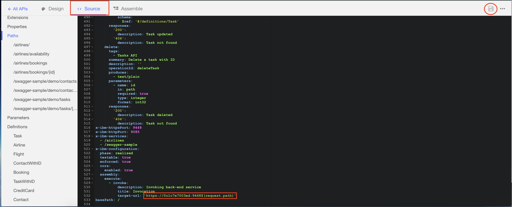

4. **모든 API**를 선택하여 메인 드래프트 페이지로 되돌아 가서 **제품**를 클릭하고 **추가 > 새 제품**를 클릭하십시오. 새 제품 추가 화면에서, 제목을 입력하고 (임의의 것도 가능) **제품 작성**를 클릭하십시오.

5. 제품을 위한 디자인 뷰가 열립니다. 아래로 스크롤하여 API 섹션으로 이동 후 + 아이콘을 클릭하십시오.

	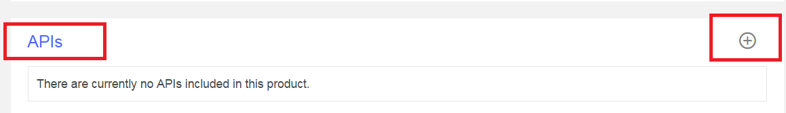

6. 방금 가져오기 한 API를 선택하고 **적용**을 클릭하십시오.

7. 플랜 섹션에서는 각각의 API를 노출하는 방법을 제어하기 위해 서로 다른 비율 한계를 가진 서로 다른 플랜을 생성할 수 있습니다. 이 예제에서는 Default Plan을 사용합니다.

	**저장 아이콘**을 클릭하여 변경 내용을 저장하십시오.

8. 이제 제품을 카탈로그에 스테이지 할 준비가 되었습니다. **클라우드 아이콘**을 클릭하고 API를 스테이지 할 카탈로그를 선택하십시오.

9. 카탈로그로 되돌아가서, 메뉴 아이콘을 클릭하고 **대시보드**를 선택하십시오. 그 다음 스테이징된 제품의 메뉴 아이콘을 클릭하고 **공개**를 선택하십시오.

	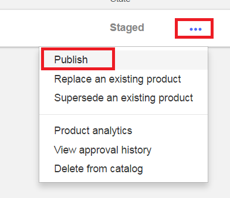

10. 새로 열린 화면에서, API를 볼 수 있는 사용자와 API Plan을 구독할 수 있는 사용자를 편집 할 수 있습니다. 이 예제에서는, 기본 값을 사용하므로 **공개**를 선택하십시오.

축하드립니다. API가 게시 되었습니다. 이제 API 소비자처럼 API Connect 개발자 포털을 탐색할 수 있습니다. **포털 URL**로 이동해서 **API 제품**을 클릭하십시오.

API 제품을 선택하고 API Connect 개발자 포털을 통해 사용해 보십시오. 어떤 API든지 클릭하고 **오퍼레이션 호출** 버튼을 이용하여 시도해 보십시오.


# 문제 해결

Docker-compose 서비스를 중지하려면, 메인 디렉토리에서 다음과 같이 실행하십시오

```bash
docker-compose down
```

Docker container를 제거하려면 다음과 같이 실행 하십시오

```bash
docker ps --all
docker kill <container ID> #run this command if your container is still running
docker rm <container ID>
```

Insights for Weather, API connect 그리고 Secure Gateway 서비스를 제거하려면, IBM Bluemix 대시보드로 이동하십시오. 그 다음 **메뉴 아이콘**을 클릭하고 **서비스 삭제**를 선택하십시오.

# 참고

이 WebSphere API Connect 예제는 developerWorks의 [게시글](https://www.ibm.com/developerworks/library/mw-1609-demagalhaes-bluemix-trs/1609-demagalhaes.html)을 바탕으로 하고 있습니다.


# 라이센스

[Apache 2.0](LICENSE)
