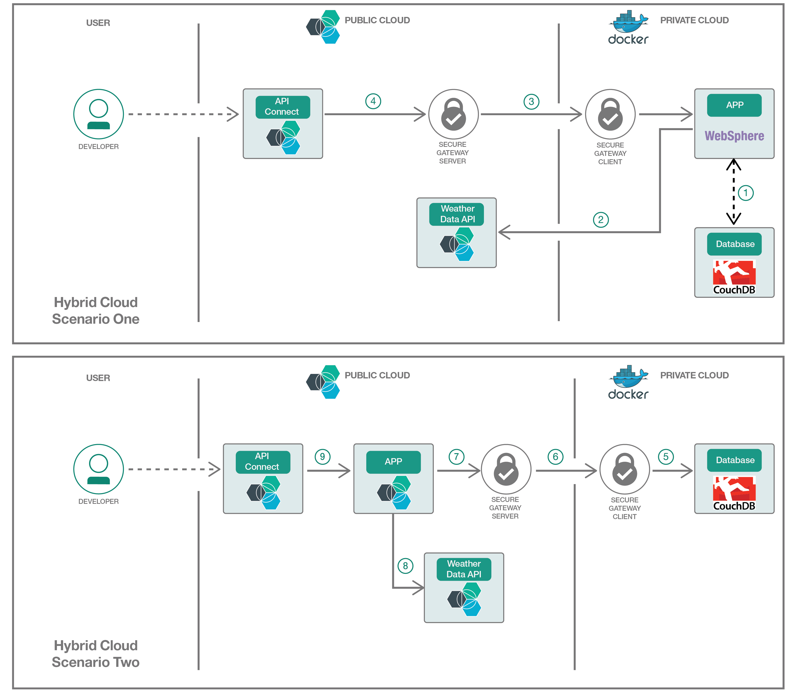

[](https://travis-ci.org/IBM/Hybrid-Cloud-Applications-and-Services)

# Extend your private cloud applications and services to public cloud, and vice versa

*Read this in other languages: [한국어](README-ko.md)、[中国](README-cn.md).*

A hybrid cloud model blends elements of both the private and the public cloud, and gives users choice and flexibility to run apps and services across on-premises systems and the cloud. In the simplest terms, the hybrid model is primarily a private cloud that allows an organization to tap into a public cloud when and where it makes sense. This code shows you how to expose your on-premise applications and services to public cloud, and vice versa.

In this code we have an on-premise Java application using JAX-RS and Swagger annotations, and database using CouchDB, both running in private cloud behind a firewall. We demonstrate how by leveraging public cloud services like Secure Gateway and API Connect we can create a tunnel and expose the private cloud application and APIs outside the corporate firewall.

Moving beyond, we move application to a public cloud, and then guide how your application running on public cloud can access on-premise resources like database etc.

## Scenarios
- [Scenario One: Enable your application in Private Cloud to be accessed externally via Public Cloud](#scenario-one-enable-your-application-in-private-cloud-to-be-accessed-externally-via-public-cloud)
- [Scenario Two: Enable your application in Public Cloud to connect to resources in Private Cloud](#scenario-two-enable-your-application-in-public-cloud-to-connect-to-resources-in-private-cloud)



## Included Components
The scenarios are accomplished by using:
- [Cloud Foundry](https://www.cloudfoundry.org/)
- [CouchDB](http://couchdb.apache.org)
- [WebSphere Liberty](https://developer.ibm.com/wasdev/websphere-liberty/)
- [API Connect](http://www-03.ibm.com/software/products/en/api-connect)
- [Secure Gateway](https://console.ng.bluemix.net/docs/services/SecureGateway/sg_overview.html)
- [Insights for Weather](https://console.ng.bluemix.net/docs/services/Weather/weather_overview.html#about_weather)

## Prerequisites

Since we need [Maven](https://maven.apache.org/install.html) to build our sample application and [Docker](https://www.docker.com/community-edition#/download) to run the application and database. Please install [Maven](https://maven.apache.org/install.html) and [Docker](https://www.docker.com/community-edition#/download) before you proceed to [steps](#steps). If you prefer to use [Vagrant](https://www.vagrantup.com/) to manage temporary environments, a build file that creates an Ubuntu VM with a JDK, Maven, and Docker is in the project home directory.

## Steps

### Connect your On-Premise environment to Public Cloud
1. [Create a tunnel to connect your on-premise environment to public cloud](#1-create-a-tunnel-to-connect-your-on-premise-environment-to-public-cloud)

### Scenario One: Enable your application in Private Cloud to be accessed externally via Public Cloud

2. [Build sample application to run on-premise and use On-Premise database](#2-build-sample-application-to-run-on-premise-and-use-on-premise-database)
3. [Run the application and database On-Premise using WebSphere Liberty, CouchDB and Docker](#3-run-the-application-and-database-on-premise-using-websphere-liberty-couchdb-and-docker)

### Scenario Two: Enable your application in Public Cloud to connect to resources in Private Cloud

4. [Build sample application to run on Public Cloud and use On-Premise database](#4-build-sample-application-to-run-on-public-cloud-and-use-on-premise-database)
5. [Run the application on Public Cloud using IBM Cloud and database On-Premise using CouchDB and Docker](#5-run-the-application-on-public-cloud-using-ibm-cloud-and-database-on-premise-using-couchdb-and-docker)

### Catalog and publish application APIs to the public using API Connect
6. [Create an API Connect service in IBM Cloud](#6-create-an-api-connect-service-in-ibm-cloud)
7. [Integrate WebSphere Liberty and API Connect: push and pull](#7-integrate-websphere-liberty-and-api-connect-push-and-pull)
- 7.1 [Push Application APIs running on WebSphere into API Connect](#71-push-websphere-liberty-apis-into-api-connect)
- 7.2 [Pull Application APIs running on WebSphere Liberty from API Connect](#72-pull-websphere-liberty-apis-from-api-connect)

[Troubleshooting](#troubleshooting)

# 1. Create a tunnel to connect your on-premise environment to public cloud

In this step, we will use the secure gateway service from IBM Cloud to create a tunnel from on-premise environment to public cloud host. In this sample, to keep configuration simple, the TCP protocol is used. The Secure Gateway product provides other protocol options (UDP, HTTP, HTTPS, TLS/SSL) that can provide greater security and authentication options for applications using the secure gateway service. Solutions with production applications and data should be assessed based upon their risk profile to select the correct Secure Gateway access protocol and authentication scheme. More details about Secure Gateway configurations can be found [here](https://console.ng.bluemix.net/docs/services/SecureGateway/sg_overview.html#sg_overview) and an example for application side and client side TLS setup can be accessed [here](https://console.ng.bluemix.net/docs/services/SecureGateway/sg_023.html#sg_023). Moving forward, we are proceeding with TCP to show the concept.

1. Create your [secure gateway service](https://console.ng.bluemix.net/catalog/services/secure-gateway?taxonomyNavigation=apis) from IBM Cloud.

2. Then, follow this [Getting started with the Secure Gateway](https://console.ng.bluemix.net/docs/services/SecureGateway/secure_gateway.html) tutorial to setup your gateway.

3. When you setup your secure gateway client, install **IBM Installer** and run it on your private cloud.

	

4. After you open the secure gateway client with your Gateway ID and Security Token, you need to add access list entries for the on-premises endpoint. If you are doing [Scenario One: Enable your application in Private Cloud to be accessed externally via Public Cloud](#scenario-one-enable-your-application-in-private-cloud-to-be-accessed-externally-via-public-cloud), run `acl allow 127.0.0.1:9443` on your secure gateway client to enable access to your application server. If you are doing [Scenario Two: Enable your application in Public Cloud to connect to resources in Private Cloud](#scenario-two-enable-your-application-in-public-cloud-to-connect-to-resources-in-private-cloud), run `acl allow 127.0.0.1:5984` to enable access to your database.

5. Now go back to your secure gateway page and create your destination. First, select **On-Premises** at Guided Setup and click next.

	

6. Next, put down **127.0.0.1** for your resource hostname and **9443**(Scenario One) / **5984**(Scenario Two) for your port and click next.

	

7. Next, select **TCP** for your protocol and click next. Then, select **None** for your authentication and click next. Then, do not put anything on your IP table rules. Lastly, name your destination and click **Add Destination**.

8. View and note your cloud host by clicking on the **gear icon** on your destination.

	

    If you are doing Scenario One, continue, else jump to [Scenario 2](#4-build-sample-application-to-run-on-public-cloud-and-use-on-premise-database).

# 2. Build sample application to run on-premise and use On-Premise database

Our sample Airline API application is an airline booking application that demonstrates how API application can store its data using on-prem database.

We will also add our own Weather API credential from public IBM Cloud for the application. The Weather API will provide the weather condition for destination airports selected by clients.


1. Create [Weather API service](https://console.ng.bluemix.net/catalog/services/weather-company-data?taxonomyNavigation=data) in IBM Cloud.

2. Go to your Weather API's **Service credentials** and mark down your username and password. (You may need to go to **New credential** to create a set first.) Then run `cd airline_app` and add your username and password credential to your `server.xml` file (replace `your_user` and `your_password` with the real service credentials):

```
        <jndiEntry jndiName="weather_user" value="your_user" />
        <jndiEntry jndiName="weather_password" value="your_password" />
```

# 3. Run the application and database on-premise using WebSphere Liberty, CouchDB and Docker

In this example, we will use WebSphere Liberty for our application server, and local CouchDB for our database. We will first build our application server docker image.

At the end of this step, you should able to call your application APIs via localhost.

1. To deploy the Airline API application, put the **.war** file in **airline_app/apps** folder and configure the **server.xml** file. For this example, we are using airlines API application, but you can also add your own application.

	In this main directory, build your server and run it on your local host.

    ```bash
    docker build -t hybrid/airlines .
    docker-compose up
    ```
   	The application server and database containers will start and the terminal will display all the logs from your app.

    After you have your server and database running, open another terminal and run the following commands to initiate couchDB.

    ```bash
    bash database_init.sh
    ```

2. To reach the WebSphere Liberty API Discovery user interface, go to `https://localhost:9443/ibm/api/explorer`. Accept any certificate warnings you see about a self-signed certificate. Use the credentials from your server.xml to login (For this example, the **username** is `admin` and the **password** is `admin`).

	You should see something like this in your API Discovery user interface.

	

3. As shown in the following screen capture, you can click the **Try it out** button, which starts the sample Airline application, running on Docker

	

4. Now, go to `https://<Cloud Host:Port>/ibm/api/explorer/` and verify your local server interface can be accessed from public 'Cloud Host' gateway server. Remember, 'Cloud Host' is the Secure gateway server information we noted down at the end of [Step 1](#1-create-a-tunnel-to-connect-your-on-premise-enviroment-to-public-cloud), and your default username is **admin** and password is **admin**. Note that since we are using TCP in this sample, being able to reach this URL means that any system on the internet can now connect to the WebSphere Liberty application if they know the name of the Cloud Host and port. In production, you would want to use TLS/SSL with [Mutual Authentication](https://console.ng.bluemix.net/docs/services/SecureGateway/sg_023.html#sg_007) for more security.

Jump to [Step 6](#6-create-an-api-connect-service-in-ibm-cloud) to expose your application APIs via API Connect

# 4. Build sample application to run on Public Cloud and use On-Premise database

Our sample API application is an airline booking application that demonstrates how API application can store its data using on-premise database and enhance its API features using IBM Cloud's Data Analytic Service.

In this step, we will add our own Weather API credential for our application and build our own .war file using Maven.


1. Create your [Weather API service](https://console.ng.bluemix.net/catalog/services/weather-company-data?taxonomyNavigation=data). The Weather API can provide the airport location and weather condition for clients.


2. Go to your Weather API's **Service credentials** and mark down your username and password.  (You may need to go to **New credential** to create a set first.) Then run `cd airline_app` and add your username and password credential to your `server.xml` file (replace `your_user` and `your_password` with the real service credentials):

```
        <jndiEntry jndiName="weather_user" value="your_user" />
        <jndiEntry jndiName="weather_password" value="your_password" />
```

3. In the Gateway configuration, set the port to 5984 (if you have been following this pattern from the beginning, your port should now be 9443 since the gateway was being used to access the Liberty app in the first part of the pattern.)  Also, run `acl allow 127.0.0.1:5984` in the Gateway client to allow ingress to the on-prem database.

4. Change the database address to your *cloud host:port* in your **server.xml** file, similar to the process used for the Weather service credentials.


# 5. Run the application on Public Cloud using IBM Cloud and database On-Premise using CouchDB and Docker

1. Create an on-premise database using Docker. Run the following commands to use the community's CouchDB Docker image.

    ```bash
    docker pull couchdb:latest
    docker run -p 5984:5984 couchdb
    ```

    Then, initiate couchDB with the following script.

    ```bash
    bash database_init.sh
    ```

2. Now, you can go back to the main directory and push your app to the cloud. For this example, we will push our app to the IBM Cloud Foundry. So we need to install the [IBM Cloud CLI](https://console.bluemix.net/docs/cli/index.html#overview)

3. Use the following commands to login to Cloud Foundry and push your application to the cloud.

    >Note: Replace <app_name> with an unique application name within your IBM Cloud region. This application name is the name of your API container.

    ```bash
    ibmcloud cf login
    ibmcloud cf push <app_name> -p airline_app
    ```

After the app starts, you will see a URL you can use to access it:

```
Waiting for app to start...

name:              airlines
requested state:   started
instances:         1/1
usage:             1G x 1 instances
routes:            airlines.opencloud-cluster.us-south.containers.appdomain.cloud
last uploaded:     Sat 13 Oct 23:33:40 EDT 2018
stack:             cflinuxfs2
buildpack:         Liberty for Java(TM) (SVR-DIR, liberty-18.0.0_1, buildpack-v3.19-20180313-1017, ibmjdk-1.8.0_20180214, env)
start command:     .liberty/initial_startup.rb
```

3. To reach the application API Discovery user interface, go to https://<app_name>.opencloud-cluster.us-south.containers.appdomain.cloud/ibm/api/explorer/ (replace with your URL from the `routes` line.) Then, use the credentials from your server.xml to login (For this example, the **username** is `admin` and the **password** is `admin`).

    You should see something like this in your API Discovery user interface.

    

4. As shown in the following screen capture, you can click the **Try it out** button, which calls your application that runs on Cloud Foundry with your on-premise database.

    

# 6. Create an API Connect service in IBM Cloud

In this step, we will setup API Connect service to help us expose our application APIs to public.

1. To add API Connect as a IBM Cloud service, go to the [API Connect service](https://console.ng.bluemix.net/catalog/services/api-connect?taxonomyNavigation=services)


2. Then, select the **Essentials plan** and click **Create**.

3. Go to dashboard by clicking here

	

4. By default, an empty catalog called **Sandbox** is created. To enable its corresponding developer portal, click **Sandbox** then **Settings**.

5. Click **Portal**, and then under **Portal Configuration**, select **IBM Developer Portal**. A Portal URL is automatically inserted.

6. Take note of the Portal URL, which reveals the target server address and organization that you need later. The URL is broken down into the following three parts, as shown in the following screen capture:

	

    - 1 is the catalog's short name, in this case, sb.
    - 2 is your organization ID, in the example, arthurdmcaibmcom-dev.
    - 3 is the target address of your API Connect instance, for example, https://us.apiconnect.ibmcloud.com.

7. Click Save (floppy disk icon) at the top right corner.

	
	
	 You will see the following message:
	 
    `
    Creating the developer portal for catalog 'Sandbox' may take a few minutes. You will receive an email when the portal is available.
    `

8. After you received the email, go to the **Portal URL** and you will see something like this.

	

	This is where enterprise developers go to find the products (for example, an API or a group of APIs) that are exposed in the API catalog. Developers also can interact with each other through the Blogs and Forums links.

# 7. Integrate WebSphere Liberty and API Connect: push and pull
> Choose either [push](#71-push-websphere-liberty-apis-into-api-connect) or [pull](#72-pull-websphere-liberty-apis-from-api-connect) WebSphere Liberty APIs from API Connect. Note: push integration won't work for users who have enterprise federated IBMids for access to IBM Cloud at the current time.

## 7.1 Push WebSphere Liberty APIs into API Connect

In this step, we will learn about how to use the post request on API discovery to push our APIs into API Connect.

1. Go to `https://<Cloud Host:Port/app_name>/ibm/api/explorer/`

2. Click **POST** for the apiconnect endpoint

	

3. Fill in the parameters as shown in the following screen capture, your organization ID should be the second part of your Portal URL.

	

4. You want to publish this API product, not just stage it, so leave the stageOnly parameter as false. The X-APIM-Authorization parameter represents the credentials that Liberty uses to log into API Connect. The description on the right side provides details on the accepted format. The following example uses: `apimanager/bluemixAccount@domain.com:myBluemixPassword`.

	


5. For Scenario Two, we can click the sample JSON file on your right and publish your APIs.

	For Scenario One, since we are running our APIs on the private cloud, we do not want to use the sample JSON file because that will set the APIs target URL to the private cloud. Instead, we want to change the `<cloud host:port>` part in **target-url** (line 38) from the following JSON file (you can also get it from the **discovery-post.json** file) to your cloud host:port (e.g. `"https://cap-sg-prd-3.integration.ibmcloud.com:16218$(request.path)"`). Then copy and paste it into the body input box.
	```JSON
	{
	  "product": "1.0.0",
	  "info": {
	    "name": "pushed-product",
	    "title": "A Product that encapsulates Liberty APIs",
	    "version": "1.0.0"
	  },
	  "visibility": {
	    "view": {
	      "enabled": true,
	      "type": "public",
	      "tags": [
	        "string"
	      ],
	      "orgs": [
	        "string"
	      ]
	    },
	    "subscribe": {
	      "enabled": true,
	      "type": "authenticated",
	      "tags": [
	        "string"
	      ],
	      "orgs": [
	        "string"
	      ]
	    }
	  },
	  "apis": {
	    "liberty": {
	      "name": "liberty-api:1.0.0",
	      "x-ibm-configuration": {
	        "assembly": {
	          "execute": [
	            {
	              "invoke": {
	                "target-url": "<cloud host:port>$(request.path)",
	                "title": "Invocation"
	              }
	            }
	          ]
	        }
	      }
	    }
	  },
	  "plans": {
	    "default": {
	      "title": "Default Plan",
	      "rate-limit": {
	        "value": "100/hour",
	        "hard-limit": false
	      },
	      "approval": false
	    }
	  },
	  "createdAt": "2017-05-01T16:13:05.912Z",
	  "createdBy": "string"
	}
	```
	

6. Now you're ready to publish these APIs. Click **Try it out!**

	

7. In less than a minute, you should see the operation return successfully (code 200), with the response content, code and headers displayed, as shown in the following screen capture:

	

Congratulations. Your API is published. Now you can explore the API Connect Developer Portal just as consumers of your API would. Go to your **Portal URL** and click **API Products**.

Select your API Product and try it through the API Connect Developer Portal. Click any API call and try it using the **call operation** button.


## 7.2 Pull WebSphere Liberty APIs from API Connect

In this step, we will learn about how to create and manage new APIs and products on API connect using API connect's user interface.

1. From the main API Connect dashboard in IBM Cloud, click the menu icon and select **Drafts**. Click **APIs**, click **Add**, and select **Import API from a file or URL**.

	

2. In the **Import API from a file or URL** window, click **Or import from URL**.

	For the URL, type the Liberty URL that you want to use to import the Swagger document. For this example, you use `https://<Cloud Host:Port/app_name>/ibm/api/docs/apiconnect`. As before, in this example the username is **admin** and password is **admin**.


3. For Scenario Two, you do not have to do anything.

After importing the cloud URL, you will see a screen like this


	
For Scenario One, since our APIs are hosted on the private cloud, we need to set the APIs target URL to the cloud host. Therefore, after you imported your API, go to **source**. Then go to the bottom of the page (around line 532) and change the **target-url**'s value to `'<cloud host:port>$(request.path)'` (replace `<cloud host:port>` to your own cloud host:port). Then click the **save icon** on the top right corner.


4. Click **All APIs** to go back into the main Drafts page, Click **Products**, and then click **Add > New Product**. In the Add a new product window, type in a title (could be anything) and then click **Add**.

5. The design view opens for the Product. Scroll down to the APIs section and click on the + icon.

	

6. Select the API you just imported, and click **Apply**.

7. In the Plans section, you can create different plans with different rate limits, to control which methods from each API are exposed. For this example, please use the default plan.

	Click the **save icon** to save your changes.

8. Now you are ready to stage your Product into a catalog. Click the **cloud icon** and select the catalog where you want to stage the APIs.

9. To go back into the catalog, click the menu icon , and select **Dashboard**. Then click the menu icon for your staged product and select **Publish**.

	

10. In the new window that opens, you can edit who can view your APIs and who can subscribe to your API Plans. For this example, use the defaults and click **Publish**.

Congratulations. Your API is published. Now you can explore the API Connect Developer Portal just as consumers of your API would. Go to your **Portal URL** and click **API Products**.

Select your API Product and try it through the API Connect Developer Portal. Click any API call and try it using the **call operation** button.


# Troubleshooting

To stop your Docker-compose services, in this main directory, run

```bash
docker-compose down
```

To remove your Docker container, run

```bash
docker ps --all
docker kill <container ID> #run this command if your container is still running
docker rm <container ID>
```

To remove your Insights for Weather, API connect and Secure Gateway service, go to your IBM Cloud dashboard. Then click the **menu icon** and then select **Delete Service**.

# License

This code pattern is licensed under the Apache Software License, Version 2.  Separate third party code objects invoked within this code pattern are licensed by their respective providers pursuant to their own separate licenses. Contributions are subject to the [Developer Certificate of Origin, Version 1.1 (DCO)](https://developercertificate.org/) and the [Apache Software License, Version 2](http://www.apache.org/licenses/LICENSE-2.0.txt).

[Apache Software License (ASL) FAQ](http://www.apache.org/foundation/license-faq.html#WhatDoesItMEAN)